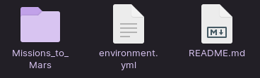

# Mars Scrape - Python Web Scraping Project

Check out the web app for this project!

<https://charlesphil-mars-scrape.herokuapp.com/>

## About this project

The purpose of this site is to demonstrate the scraping, loading, and storage of many types of content from websites related to Mars and Mars exploration. To access the elements in the HTML, I used the popular [BeautifulSoup Python library](https://www.crummy.com/software/BeautifulSoup/bs4/doc/). To automate the clicking of items for access to these high quality images, I used the [Splinter Python library](https://splinter.readthedocs.io/en/latest/) to interact with elements in these pages.

The "Latest News" card scrapes the NASA news page to obtain a high resolution image link of the article as well as getting the headline and blurb.

The "Image of the Week" comes from NASA's home page, which gets the link from the image element along with the name of the image.

The "Mars Facts" card scrapes the table element on the NASA Mars Facts page and is processed using the [Pandas Python library](https://pandas.pydata.org/), which then gets exported as a string of HTML code.

Lastly, the "Mars Hemisphere" card gets the high resolution images and names from the [United States Geological Survey Astropedia](https://astrogeology.usgs.gov/search/results?q=hemisphere+enhanced&k1=target&v1=Mars) page on Mars.

For storing the data, I opted to use MongoDB, a NoSQL database, as this project mainly reads stored data that will not change very frequently. I do not have much need to write large amounts of data, and instead I am solely focused on easy content management of a few documents.

## Installation

### Setting up the environment

This project uses [Anaconda environments](https://docs.conda.io/projects/conda/en/latest/user-guide/tasks/manage-environments.html) to manage dependencies. In order to install the dependencies required for running the Flask app and Jupyter Notebook, first clone the repository and go to the console and type `conda env create -f environment.yml` while in the project repository with Anaconda running to set up the Conda environment.

Once installed, activate the environment with `conda activate mars_scrape` and you will then be able to run the Python app inside Missions_to_Mars.

*Your console will look different depending on your set up.*

### Running the Flask App

Once the environment is set up, navigate your console to `Missions_to_Mars/` and run the command `Python app.py`.

Open either **Google Chrome** or **Mozilla Firefox** to the localhost address listed in your console (most commonly will be <http://127.0.0.1:5000/>). This project requires either Chrome or Firefox to be installed on your system as the web automation library uses either the Chrome or Gecko web drivers to run the scrape.

### Start the Mongo database

This project requires [MongoDB](https://www.mongodb.com/), a NoSQL database. If MongoDB is not installed on your device, please refer to <https://www.mongodb.com/try/download/community> for installation.

Please follow these instructions to install and start the service on your platform:

**[Windows](https://www.mongodb.com/docs/manual/tutorial/install-mongodb-on-windows/)**

**[macOS](https://www.mongodb.com/docs/manual/tutorial/install-mongodb-on-os-x/)**

**[Linux (Red Hat, Ubuntu, Debian, SUSE, Amazon)](https://www.mongodb.com/docs/manual/administration/install-on-linux/)**
